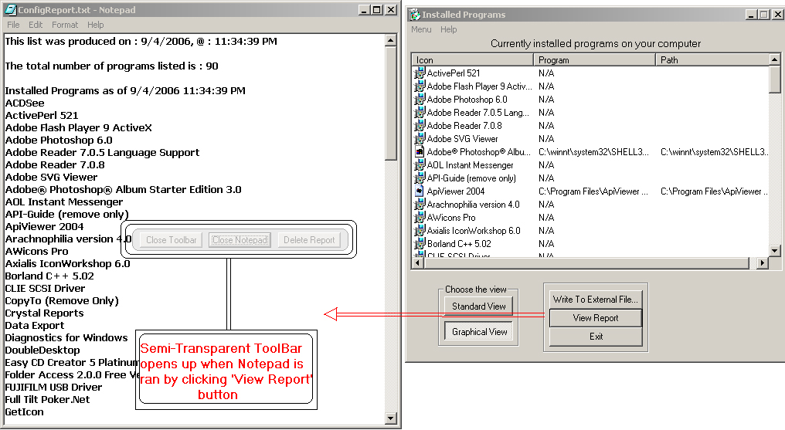



## Lists all installed apps on your system, and displays corresponding icons and notifies you of change

### Description

This application is a great example of using registry to list all installed programs on your computer. It loops through all entries, eliminates doubles, extracts icons, and presents a list. You then have an option to save that list to a TXT file. Once it's saved, you can then view the report via textpad - or if there are any error(Such as no notepad), it will use its internal text viewer application. Also, after every time you run the application, it remembers the number of apps installed, so if the number of installed apps has changed, it will notify you. Another good example in this app, is opening/closing notepad from inside the program. When you open notepad through this app, you will see a semi-transparent toolbar, with options to Close Notepad, close toolbar or exit. When you close notepad, the toolbar disappears. I will continue working on this aplication, the main purpose of it is to run on start-up, and check if somehow through internet any programs were installed(that seems to happend alot, for example,

a Yahoo toolbar gets installed to your browser when signing up for email, and not paying attention...)
 
### More Info
 

             |
---                |---
**Submitted On**   |2006-09-08 23:12:22
**By**             |[Serge\_G](https://github.com/Planet-Source-Code/PSCIndex/blob/master/ByAuthor/serge-g.md)
**Level**          |Intermediate
**User Rating**    |4.7 (28 globes from 6 users)
**Compatibility**  |VB 4\.0 \(32\-bit\), VB 5\.0, VB 6\.0
**Category**       |[Complete Applications](https://github.com/Planet-Source-Code/PSCIndex/blob/master/ByCategory/complete-applications__1-27.md)
**World**          |[Visual Basic](https://github.com/Planet-Source-Code/PSCIndex/blob/master/ByWorld/visual-basic.md)
**Archive File**   |[Lists\_all\_201892992006\.zip](https://github.com/Planet-Source-Code/serge-g-lists-all-installed-apps-on-your-system-and-displays-corresponding-icons-and-notif__1-66465/archive/master.zip)

